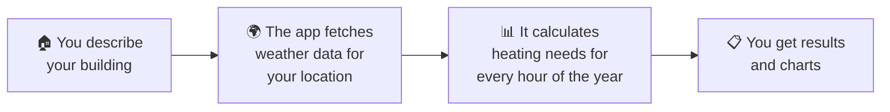

# 🔥 Heat Pump Sizing Calculator — Project Walkthrough

## What Is This Project?

This project is a **Heat Pump Sizing Calculator** — a web-based tool that helps homeowners, engineers, or installers figure out exactly what size heat pump a building needs to stay warm throughout the year.

Think of it like this: before you buy a heater for your house, you want to know **"how powerful does it need to be?"** Too small, and your house will be cold on the worst winter days. Too big, and you've wasted money. This calculator answers that question using **real weather data** for your specific location.

---

## How Does It Work? (The Big Picture)

The calculator works in three simple steps:

### Step 1 — You Fill In a Form

You provide information about your building:

| What You Enter | Why It Matters |
|---|---|
| **Wall, Roof, Floor areas** (in m²) | Bigger surfaces = more heat escaping |
| **U-Values** for walls, roof, floor | How well-insulated each surface is (lower = better insulated) |
| **Location** (latitude & longitude) | To get the right weather data for your area |
| **Flow Temperature** | The temperature of water flowing through your heating system |
| **Max Heat Output** (kW) | How powerful the heat pump you're considering is |
| **Indoor Temperature** | The temperature you want your house to be (usually 20°C) |
| **Base Temperature** | Below this outdoor temperature, heating kicks in |

### Step 2 — The App Fetches Weather Data

Once you click **"Calculate Heat Requirements"**, the app reaches out to a service called **PVGIS** (run by the European Commission). PVGIS provides something called **Typical Meteorological Year (TMY)** data — essentially, a year's worth of hourly weather readings that represent the "average" weather at your location, compiled from over 15 years of recordings.

This gives the app **8,760 data points** (one for every hour of the year), including the outdoor temperature for each hour.

> [!NOTE]
> This is NOT live weather — it's a carefully composed "typical" year based on historical patterns. It's perfect for planning and sizing equipment because it represents what you can normally expect, rather than one unusually hot or cold year.

### Step 3 — The Math Happens

For **every single hour** of that typical year, the calculator asks:

1. **Is it cold enough to need heating?** (Is the outdoor temperature below the base temperature?)
2. **If yes, how much heat is escaping the building?** (Using the wall/roof/floor areas and their U-values)
3. **Can the heat pump keep up?** (Is the heat loss greater than the pump's maximum output?)
4. **How much electricity does the heat pump use?** (Based on something called COP — how efficiently the pump converts electricity into heat)

If the heat pump **can't keep up** during the coldest hours, the calculator tracks how many hours the house would drop below your desired temperature and by how much.

---

## What Results Do You Get?

After a few seconds of crunching numbers, you see:

### Summary Cards

| Result | What It Means |
|---|---|
| **Annual Heat Energy** | The total energy needed to heat your building for the year (in kWh) |
| **Electrical Energy** | How much electricity the heat pump would consume |
| **Average COP** | The efficiency of the heat pump across the year — a COP of 3 means for every 1 unit of electricity, you get 3 units of heat |
| **Hours Over Capacity** | How many hours per year the heat pump can't keep up with demand |
| **Peak Heat Load** | The highest heating demand at any single hour — the "worst case" |
| **Recommended Size** | The minimum heat pump size to handle almost all situations |

### Monthly Chart

A bar chart showing **heat energy** and **electrical energy** for each month. You can immediately see that winter months (December, January, February) need far more heating than summer months (which might need none at all).

### Daily Detail Chart

You can pick any specific day (e.g., January 15) and see an hour-by-hour breakdown:
- **Outdoor temperature** throughout the day
- **Electricity used** by the heat pump each hour
- **Indoor temperature** — does it stay at your target, or dip on the coldest hours?

---

## The Files That Make It Work

The project has just a handful of files:

### 📄 `index.html` — The Page You See

This is the entire user interface — the form you fill out, the buttons, the charts, and the results cards. It's all in one file, including the styling (colours, layout) and the logic for handling your button clicks and drawing charts.

### ⚙️ `server.js` — The Brain Behind the Scenes

This does the heavy lifting. When you click "Calculate", this file:
1. Receives your building details
2. Calls the PVGIS weather service to get hourly temperature data
3. Runs the heat loss calculations for every hour of the year
4. Sends the results back to the page

### 📦 `package.json` — The Ingredient List

This simply lists what the project depends on (just one thing: **Express**, a tool that lets the server respond to web requests).

### 🚫 `.gitignore` — The "Don't Upload" List

Tells the version control system to skip certain files (like downloaded dependencies) when saving the project.

---

## Key Concepts Explained Simply

### What is a U-Value?
A U-Value measures how easily heat passes through a material. A brick wall might have a U-value of 1.5, while a well-insulated wall might be 0.2. **Lower is better** — it means less heat escaping.

### What is COP (Coefficient of Performance)?
COP tells you how efficient a heat pump is. A COP of 3 means for every 1 kW of electricity, the pump produces 3 kW of heat. Heat pumps are more efficient when the outside temperature is mild and less efficient when it's very cold.

### What is "Hours Over Capacity"?
This is the number of hours per year when the heating demand exceeds what your heat pump can deliver. During these hours, your indoor temperature would drop slightly below your target. A few hours per year is usually acceptable; hundreds of hours means the heat pump is too small.

### What is Base Temperature?
This is the outdoor temperature below which your building needs heating. Above this temperature, the building stays warm enough on its own (from appliances, body heat, sunlight, etc.).

---

## What Was Fixed

During development, two issues were found and resolved:

1. **Weather data wasn't being read correctly** — The weather service labels its timestamps as `time(UTC)`, but the app was looking for just `time`. This meant no data was making it to the charts. Fixed by using the correct label.

2. **Charts appeared blank** — The charts were being drawn while their container was still hidden, so they had no space to draw into. Fixed by making the results area visible *before* drawing the charts.

---

## How to Run It

1. Open a terminal in the project folder
2. Run `npm install` (first time only — downloads dependencies)
3. Run `node server.js`
4. Open your browser to **http://localhost:3000**
5. Fill in the form and click **"Calculate Heat Requirements"**

> [!TIP]
> Don't know your building's U-values? Typical UK values are roughly: Walls 0.20–0.30, Roof 0.13–0.20, Floor 0.15–0.25 for modern construction. Older buildings will have higher (worse) values.

---

## Summary

This calculator takes the guesswork out of choosing a heat pump. Instead of relying on rough estimates, it uses **real weather patterns** for your exact location and **your building's actual insulation** to determine precisely how much heating you need — hour by hour, month by month, across an entire year.
